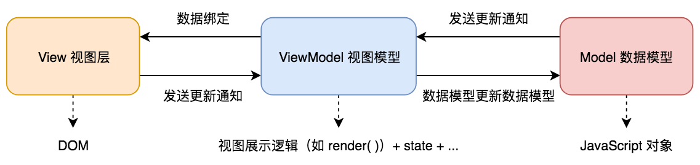

# 对 MVVM 的理解

1. `MVVM` 框架（`Model-View-ViewModel`（[wiki][wiki-mvvm]））三要素

    - 响应式（[演示][vue-reactive]）

        - 响应式原理是为了在 `web` 应用被渲染的数据发生改变时，自行以最优解对目标节点进行更新。或者视图发生变化时，通知 `Model` 进行数据修改。

    - 模板引擎

    - 渲染（`ViewModel` 中的视图展示逻辑）

        - `vdom` 借由 `diff` 算法可以在操作 `DOM` 时带来极低的性能消耗（原因：章节 - [Virtual DOM](../adv-virtual-dom.md)）。

        

        注：如在 `Vue.js` 中，`View` 通过事件监听来实现通知 `ViewModel` 更新，`Model` 通过数据绑定来通知 `ViewModel` 操作 `DOM`。

2. 传统 JS 库（如 `jQuery`）与 `MVVM` 框架的差异

    - 使用传统 JS 框架或原生 JS 开发时：

        - 必须同时顾及业务逻辑实现与 `DOM` 操作最优解。即数据模型与视图层混杂在一起，**形成耦合**。即**关注点混杂**，后期应用拓展常常需要兼顾之前的模块逻辑，违背开放封闭原则。
        
        - 当 `web` 应用后期拓展到一定复杂度后，其中的复杂的 `DOM` 操作将可能带来巨大的性能消耗。后期的拓展和维护也将要付出昂贵的成本，每一次拓展和维护都要顾及对之前的 `DOM` 树的影响。

        - 因为前期不需要搭建额外的视图模型（`ViewModel`，视图层与数据模型之间通信的桥梁），那么在小型简单 `web` 应用开发方面传统 JS 框架或原生 JS 开发仍保持着开发流程简洁的优势。

    - 使用 `MVVM` 框架时，体现[关注点分离原则][wiki-关注点分离]：

        - **数据模型（`model`，即业务逻辑）与视图层（`View`）分离**，将二者**解耦**（使得后期拓展更易遵循开放封闭原则）。其中建立一个视图模型（`ViewModel`）中间层用于数据模型与视图层的通信。

        - **以数据驱动视图更新**，只关心数据模型的变化，DOM 操作被封装。开发人员只需要专注 JS 逻辑的实现即可。并不需要直接接触真实 `DOM`，`MVVM` 框架会自行通过 `web` 应用的数据来驱动真实 `DOM` 的渲染。所有真实 `DOM` 树的更新都是依靠 `ViewModel` 来实施高效的页面渲染和更新。

[wiki-mvvm]:https://zh.wikipedia.org/wiki/MVVM

[vue-reactive]:https://github.com/lbwa/vue-reactive

[wiki-关注点分离]:https://zh.wikipedia.org/wiki/%E5%85%B3%E6%B3%A8%E7%82%B9%E5%88%86%E7%A6%BB

# 实现 MVVM

（以 `Vue.js` 为例）

## Vue.js 中响应式原理

（[演示][vue-reactive]）

## Vue.js 如何解析模板

## Vue.js 核心原理 —— 流程实现
