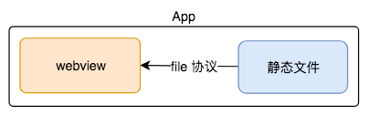
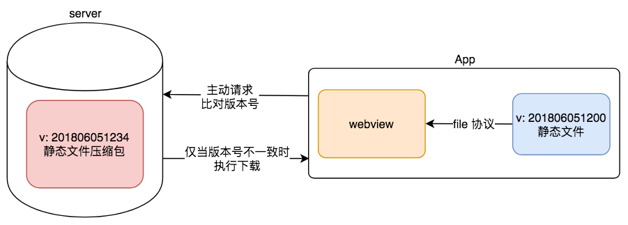

# Hybrid

`hybrid` 指前端和客户端的混合开发。客户端承载前端的内容。客户端是前端内容的容器。

## hybrid 存在价值

1. 可以 ***快速*** 迭代更新 - 核心意义

    - 因为 `hybrid` 是使用前端三大语言开发，权限低，无法获取手机的隐私等安全性信息，那么 `hybrid` 页面更新是 ***不需要 `app` 审核*** 的。

2. 与 `Native` 应用体验基本类似

3. 开发成本低，双端可以共用一套代码

## webview

1. `app` 中非必要组件，一类组件的统称。

2. 用于加载 `HTML5` 页面，即一个小型浏览器精简内核。

## file 协议

`file` 协议用于本地文件请求，相较于 `http(s)` 请求的 ***速度快*** 得多。

## 具体实现

1. 选型

    - 使用 `Native`：追求极致体验，变化不频繁的场景。

    - 使用 `hybrid`：体验要求高，且变化频繁的场景（如新闻详情页）。

    - 使用 `HTML5`：体验无要求，不常用的页面（如反馈等页面）。

2. 流程

    1. 前端做好静态页面（`HTML`、`CSS`、`JS`），将静态文件移交客户端开发。

    2. 客户端开发以文件形式嵌入存储在 `app` 中。

    3. 客户端在一个 `webview` 中使用 `file` 协议读取本地静态文件。

        

3. 更新

    - `app` 发布后，如何更新静态文件？

        因为前端语言都存在于客户端容器内，那么此时的前端语言是没有权限更新静态文件的，只有客户端有权限来完成更新静态文件的操作。

        1. 在服务端维护静态文件压缩包和版本号。

        2. 在一个时机被触发时（如启动 App 时），客户端主动去请求 `server` 比对版本号。
        
        3. 仅在版本号不一致的情况下下载最新的静态文件压缩包，并在客户端解压，即可得到新的静态文件。

            

    - 静态页面如何动态获取文字内容（如新闻，作者等内容）？

      见本章 - 前端和客户端通信

## hybrid 与 HTML5 对比

- `hybrid` 优点

    1. 可快速迭代更新

    2. 与 `Native` 应用体验基本相似

- `hybrid` 缺点

    1. 开发成本高。联调、测试、debug 等都有很高的成本。

    2. 运维成本高。

- 适用场景

    1. `hybrid` 适用于产品型场景，它要求稳定，体验要求高，迭代频繁

    2. `HTML5` 侧重活动运营，如单次运营活动或不常用的功能（如反馈页面）。

## 前端和客户端通信

- 静态页面如何动态获取文字内容（如新闻，作者等内容）？

    1. `ajax` 的局限性。

        - app 是本地读取的静态文件，是 `file` 协议。若 `ajax` 请求获取，则是 `http(s)` 协议，三源之一（协议）不一致将导致客户端因跨域而拒绝解析返回的数据（[extension][cross-domain-solution]）。

        - 另外，可通过跨域解决方案（[extension][cross-domain-solution]）解决跨域问题。但是，`ajax` ***请求速度慢***，需要经历打开目标页才能启动 JS 请求，请求下完成后再渲染得到的内容。

    2. 客户端获取更新文字内容，与 1 不同的是，客户端更新内容可 ***提前获取***。

        - 比如可在还没有进入到目标内容页的情况下，就可以提前由客户端发起请求来 ***预取*** 内容。

[cross-domain-solution]:https://lbwa.github.io/2018/04/19/Cross-domain-solution/

### JS 和客户端通信的基本形式

（原理类似 `JSONP` 的形式。）

1. JS 向客户端传递参数和回调函数

2. 客户端通过回调函数返回内容。

### `schema` 协议简介和使用

在前端中，除了 `http(s)` 协议与 `file` 协议，还有 `schema` 协议是用于前端和客户通信的协议。

```
/* 格式形如: */
weixin://dl/scan
```

`schema` 协议的使用逻辑示例：

```js
// 以下省略了权限验证
const iframe = document.createElement('iframe')
iframe.style.display = 'none'

// iframe 通过 `schema` 协议访问客户端
// a. 无参数访问
iframe.src = 'weixin://dl/scan'

// b. 传参访问
window['_wx_scan_callback_'] = function (result) {
  // do something
}
iframe.src = 'weixin://dl/scan?keyword=value&callback=_wx_scan_callback_'
// 返回 _wx_scan_callback({ key: value })，即调用 _wx_scan_callback 函数解析其中的数据

const body = document.body || document.getElementsByTagName('body')[0]
body.appendChild(iframe)
// 异步销毁 iframe，防止内存泄漏
setTimeout(() => {
  body.removeChild(iframe)
  iframe = null
})
```

### `schema` 使用的封装

```js
function _invoke (type, data, callback) {
  // 省略验证 data 和 callback 兼容处理

  // package schema url
  const schema = `schema://utils/${type}`

  // add params to url
  if (data) {
    scheme = scheme + '?'
    const keys = Object.keys(data)
    const len = keys.length

    keys.forEach(dataKey => {
      if (dataKey !== keys[len - 1]) {
        schema += `${dataKey}=${data[dataKey]}&`
      } else {
        scheme += `${dataKey}=${data[dataKey]}`
      }
    })
  }
  
  const callbackName = ''
  if (typeof callback === 'String') {
    callbackName = callback
  } else {
    // declare a function in window when callback is a function
    // It will be called when scheme respond
    callbackName = `${type}${Date.now()}`
    window[callbackName] = callback
  }

  scheme += `&callback=${callbackName}`
  // package schema url ending

  // perform request
  const iframe = document.createElement('iframe')
  iframe.style.display = 'none'
  iframe.src = schema
  const body = document.body || document.getElementsByTagNames('body')[0]
  body.appendChild(iframe)

  // Once schema request invoked, we can destroy iframe
  // It's used to prevent too many iframe to memory overflow
  setTimeout(() => {
    body.removeChild(iframe)
    iframe = null
  }, 0)
}

// expose API
window.invoke = {
  scan: function (data, callback) {
    _invoke('scan', data, callback)
  } 

  share: function (data, callback) {
    _invoke('share', data, callback)
  },
}
```
```js
// invoke API
window.invoke.share({}, function (res) {
  if (res.errno === 0) {
    // do something right
  } else {
    console.error(`Request fail, errno is ${res.errno}`)
  }
})
```
