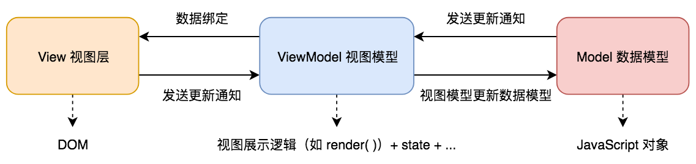
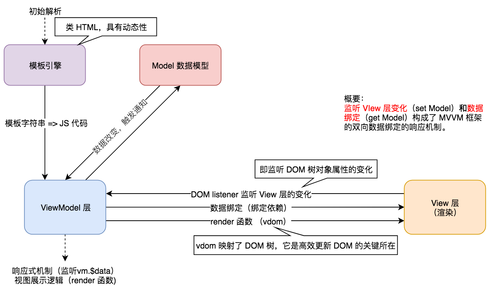

# MVVM 架构模式

## 对 MVVM 的理解

1. 定义

    - `Model` 数据模型，一般是 `JavaScript` 对象，用于存储业务数据。

    - `ViewModel` 视图模型，如 `Vue.js` 。其中包含视图展示逻辑、数据状态等一系列必要因素。

    - `View` 视图层，即 `DOM` 树。

        

    注：如在 `Vue.js` 中，通过 `DOM listener` 监听 `View` 变化来通知 `ViewModel` 更新 `Model`，`Model` 通过 `数据绑定`（`Data binding`）来通知 `ViewModel` 操作 `DOM`。

2. `MVVM` 框架（`Model-View-ViewModel`（[wiki][wiki-mvvm]））三要素

    - 响应式（👉Repo: [演示][vue-reactive]）

        - 响应式原理是为了在 `web` 应用被渲染的数据发生改变时，自行以最优解对目标节点进行更新。或者视图发生变化时，通知 `Model` 进行数据修改。

    - 模板引擎

        - 模板的语法与普通 `HTML` 语法相近。

        - 相较于 `HTML` 的静态特性，模板是动态的，模板能够实现逻辑（如 `v-for`、`v-if`）并且能够内嵌 JS 变量。

        > 编译逻辑：模板（字符串） => 转换为 js 代码实现逻辑和变量 => HTML

    - 渲染（`ViewModel` 中的视图展示逻辑）

        - `ViewModel` 中的视图展示逻辑通过 `render` 函数来实现，其中 `render` 函数的**核心**是 `vdom`。

        - `vdom` 借由 `diff` 算法可以在操作 `DOM` 时带来极低的性能消耗（原因：章节 - [Virtual DOM](./../adv-virtual-dom.md)）。

3. 传统 JS 库（如 `jQuery`）与 `MVVM` 框架的差异

    最大的区别就是 `MVVM` 框架实现了 **关注点分离**。

    - 使用传统 JS 框架或原生 JS 开发时：

        - 必须同时顾及业务逻辑实现与 `DOM` 操作最优解。即数据模型与视图层混杂在一起，**形成耦合**。即**关注点混杂**，后期应用拓展常常需要兼顾之前的模块逻辑，违背开放封闭原则。
        
        - 当 `web` 应用后期拓展到一定复杂度后，其中的复杂的 `DOM` 操作将可能带来巨大的性能消耗。后期的拓展和维护也将要付出昂贵的成本，每一次拓展和维护都要顾及对之前的 `DOM` 树的影响。

        - 因为前期不需要搭建额外的视图模型（`ViewModel`，视图层与数据模型之间通信的桥梁），那么在小型简单 `web` 应用开发方面传统 JS 框架或原生 JS 开发仍保持着开发流程简洁的优势。

    - `MVVM` 框架通过建立一个 `视图模型 ViewModel` 来解耦 `数据模型 Model` 和 `视图层 View`：

        - **建立视图模型（`ViewModel`）中间层**用于数据模型与视图层的通信，使得后期拓展更易遵循开放封闭原则。

        - **以数据驱动视图更新**，只关心数据模型的变化，DOM 操作被封装。开发人员只需要专注 JS 逻辑的实现即可。并不需要直接接触真实 `DOM`，`MVVM` 框架会自行通过 `web` 应用的数据来驱动真实 `DOM` 的渲染。所有真实 `DOM` 树的更新都是依靠 `ViewModel` 来实施高效的页面渲染和更新。

[wiki-mvvm]:https://zh.wikipedia.org/wiki/MVVM

[vue-reactive]:https://github.com/lbwa/vue-reactive

[wiki-关注点分离]:https://zh.wikipedia.org/wiki/%E5%85%B3%E6%B3%A8%E7%82%B9%E5%88%86%E7%A6%BB

## 实现 MVVM

（以 `Vue.js` 为例）

### 1. Vue.js 中响应式原理

（👉Repo: [演示][vue-reactive]）

### 2. Vue.js 如何解析模板

1. 模板

    1. 本质：字符串

    2. 内含**逻辑**语句，如 `v-if`、`v-for` 等语句
    
    3. 对比静态的 `HTML`，模板是**动态**的。

    4. 最终的编译结果是 `HTML`。

        - 模板必须转换为 JS 代码来实现模板中的**逻辑**语句和引用的 JS **变量**。
        
            - 前端三大语言中只有 JS 具有逻辑实现，即图灵完备语言。

        - 三大语言中只有 JS （`render` 函数）能实现将字符串转换为 `HTML`。
2. `render` 函数

    1. 模板中的所有信息在 `render` 函数中均有体现

        - 模板如下：
        ```html
        <div class="app">
          <p>{{name}}</p>
        </div>
        ```
        - `render` 函数体如下：
        ```js
        // with 用于指定 with 代码块中的上一级作用域，在查询当前作用域中未声明变量的声
        // 明时，起作用
        // this 指向 vue 实例 vm
        with(this) {
          // _c 即 vm._c，调用 createElement()，即创建 vnode
          return _c(
            'div',
            {
              attrs: {'id': 'app'}
            },
            [
              // name 即 vm.name 即 vm._data.name
              // vm._v 即 createTextVNode(val)，创建 文本 vnode
              // vm._s 即 toString(val)，转换变量 name 为字符串
              _c('p', [_v(_s(name))])
            ]
          )
        }
        ```
        注：暂只关心设计理念，模板转换为 JS 代码（`render` 函数）的过程属于工具化细节，暂不过多纠结。
    
    2. `Vue.js` 指令实现

        ```html
        <input v-model="msg" @keyup.enter="submit" type="text" id="inputPanel">
        ```

        ```js
        // 拦截 Vue.js 源码中 `code.render` 可以得到当前模板转换后的 render 函数
        with (this) { // this 即为 vm
          return _c(
            'input',
            {
              directives: [
                {
                  name: "model",
                  rawName: "v-model",
                  // v-model 绑定的值
                  value: (msg),
                  expression: "msg"
                }
              ], 
              // HTML 标签字符串的属性
              attrs: {
                "type": "text",
                "id": "inputPanel"
              },

              // DOM 树对象（由浏览器转换 HTML 字符串而来）自身的属性
              domProps: {
                // DOM 绑定 vm.msg
                // 即当赋值 vm.msg 时，DOM 会做出相应改变
                "value": (msg)
              },

              // 监听事件
              on: {
                "keyup": function ($event) {
                  if (!('button' in $event)
                    && _k($event.keyCode, "enter", 13, $event.key, "Enter")) return null;
                  return submit($event)
                },

                // 由 v-model 指令添加的 input 事件监听
                "input": function ($event) {
                  if ($event.target.composing) return;
                  // 当输入事件触发时，设置 vm.msg 的值
                  msg = $event.target.value
                }
              }
            }
          )
        ```

        - v-model 实现

            `v-model` 指令本质是一个语法糖，他是监听 `DOM` 树对象属性和监听 `input` 事件的封装。

            ```js
            domProps: {
              // 即 document.querySelector('input').value = msg
              "value": (msg)
            }
            // ...
            on: { // 此处亦是 v-on 的实现
              "input": function ($event) {
                if ($event.target.composing) return;
                // 当输入事件触发时，设置 vm.msg 的值
                msg = $event.target.value
              }
            }
            ```

        - `v-for` 实现

            `v-for` 本质是 `for 循环` 得到目标元素的 `render` 函数所构成的数组，该数组可用于父 `render` 函数中。
            
            （`v-if` 本质是 `if 语句判断`）

            模板如下：

            ```html
            <ul>
              <li v-for="item in items">{{item}}</li>
            </ul>
            ```

            `render` 函数如下：

            ```js
            _c(
              'ul',
              // vm._l 即 renderList 函数
              // 返回一个每项均为 li 的 render 函数的数组
              _l((items),
                function (item) {
                  return _c(
                    'li',
                    [
                      _v(_s(item))
                    ]
                  )
                }
              )
            )
            ```
    3. `render` 函数（`vm._c`）逻辑

        `Vue.js` 中的 `render` 函数是由 `snabbdom` 演变而来。如他们的传参方式。

        - `vm._c` 即相当于 `snabbdom` 中的 `h` 函数（API 见章节 - [Virtual DOM](./../adv-virtual-dom.md)），最终将创建一个 `vnode`。

            ```js
            /**
             * 1. src/core/instance/lifecycle.js 定义
             *    Vue.prototype._update = function () {}
             * 2. vm._update 用于对比新旧 vnode 的差异
             */
            vm._update(vnode) {
              // 在对比新旧 vnode 之前，缓存旧的 vnode
              const prevVnode = vm._vnode

              // 缓存新的 vnode，用于下一次对比
              vm._vnode = vnode
              if (!prevVnode) {

                // 初次渲染，挂载到 vm.$el 上，并渲染出真实 DOM，并形成 DOM 映射
                // vm.__patch__ 即如同 snabbdom 中的 patch 函数
                vm.$el = vm.__patch__(vm.$el, vnode)
              } else {

                // 将新 vnode 对比旧的 vnode 得到差异并根据 DOM 映射进行 DOM 更新
                vm.$el = vm.__patch__(prevVnode, vnode)
              }
            }

            /**
             * 1. src/core/instance/lifecycle.js 定义
             * 2. 仅用于 Watcher 实例中
             * 结合响应式原理：
             * vm.$data[someData] 的 setter
             * --> dep.notify()
             * --> subs[i].update()
             * --> updateComponent
             * --> vm._render
             */
            function updateComponent () {
              // vm._render() 即 render 函数，即 vm._c，调用后将返回一个新的 vnode
              vm._update(vm._render())
            }
            ```

### 3. Vue.js 实现的整体流程

1. 解析模板为 JS 代码实现模板中的逻辑，并构建 `render` 函数

    - 实现 `v-if`、`v-for`、`v-on` 等模板中的逻辑语句。

    - 构建 `render` 函数，并得到 `vdom`，`vdom` 与将真实 `DOM` 树形成映射。

2. 形成响应式机制

    - 重写 `数据对象`（如 `vm.$data[dataName]`） 的 `getter` 和 `setter`。

        - `getter` 添加 `收集依赖` 方法 `dep.depend()`，使其**选择性**在依赖收集容器 `dep.subs` 中添加数据依赖 `Watcher`，以避免不必要的渲染。

            - 之所以建立 `dep.depend()`，是为了只为 **参与构建** `DOM` 的数据对象 `$data[someData]` 提供数据依赖。

                - 实现逻辑：添加当前 `Watcher` 实例（即数据依赖）到当前数据依赖存储容器 `dep.subs` 中（[详细][vue-reactive-watcher]）。

            - 每个 `数据对象` 都有一个独享的 `dep` 实例，它是以**闭包变量**的形式与**每个** `数据对象` 相关联（[示例][vue-reactive-dep]）。

        - `setter` 添加 `更新依赖` 函数 `dep.notify()`，使其在变化时触发依赖收集更新。

            - 在 `setter` 中触发更新依赖函数时，未参与构建 `DOM` 中的数据对象容器是没有数据依赖的（即 `dep.subs` 为空数组），即不会触发后续的一系列更新 `DOM` 的方法，即**避免了不必要的重复渲染**。

        注：`Vue.js` 中数据依赖都是以 `Watcher` 的实例为形式存储的（`subs` 数组），`Watcher` 存在一个原型方法 `update`。`update` 方法在被调用时，将调用 `Vue` 的原型方法 `_render`（即 `render` 函数）。

    - 在 `Vue.js` 中将 `data` 选项中的属性代理到 `Vue` 实例下。
    
        - 因为在 `render` 函数中指定了 `with` 作用域都是在 `Vue` 实例下，而不是 `data` 之类的选项中，那么此处的数据代理是必不可少的。

    - `DOM listener` 监听 `View` 层的 `DOM` 树对象属性的变化。

[vue-reactive-dep]:https://github.com/lbwa/vue-reactive/blob/master/reactive.js#L8

[vue-reactive-watcher]:https://github.com/lbwa/vue-reactive#watcher

[vue-reactive-selected-watcher]:https://github.com/lbwa/vue-reactive#选择性触发-watcher

3. 首次渲染，且绑定依赖

    - 将 `render` 函数渲染成真实 `DOM`。

        - 执行 `render` 函数实现初次 `DOM` 渲染。

        > `updateComponent` --> `vm._render` --> `vm.__patch__(vm.$el, vnode)` --> 生成 `DOM` 树
        
        - 缓存当次的 `vnode` 为 `vm._vnode` 以用于下次 `vm.__patch__(vnode, prevVnode)` 成为 `prevVnode` 对比新的 `vnode`。

    - 绑定依赖

        - 在执行 `render` 函数时，就会访问到 `数据对象`（因为先前在模板中使用了代表 `数据对象` 的变量，需要将变量转化为 `DOM` 节点），就会触发 `2` 中的响应式机制，即触发 `getter` 函数中的 `dep.depend()`，那么就会只对 **参与构建** `DOM` 树的 `数据对象` 开始收集数据依赖并存储于容器中。

4. 响应式机制的依赖发生变化时将触发 `re-render`

    - `Model` 层发生变化

    > `vm.$data[dataName]` 的 `setter` --> `dep.notify()` --> `subs[i].update()` --> `updateComponent` --> `vm._render` --> `vdom` 中的 `vm.__patch__(vnode, prevVnode)` --> 更新 `DOM`

    - 补充：`View` 层发生变化

        `View` 层将通知 `ViewModel` 以更新对应 `Model` 中的值。
    
        
        